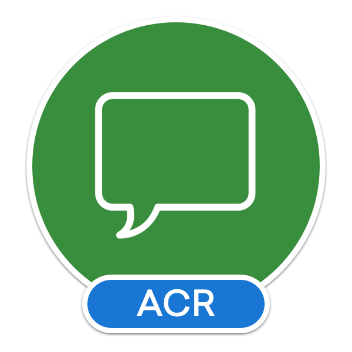

#  ACR User Dialogs

A cross platform library that allows you to call for standard user dialogs from a shared/portable library.
Supports Android, iOS, and Unified Windows Platform (UWP, UAP)

[Change Log - February 18, 2019](docs/changelog.md)

### Features

_Docs are a work in progress (looking for help!)

* [Action Sheet](docs/actionsheets.md)
* [Alert](docs/alerts.md)
* [Confirm](docs/confirm.md)
* [Date](docs/date.md)
* [Loading/Progress](docs/progress.md)
* [Login](docs/login.md)
* [Prompt](docs/prompt.md)
* [Toasts](docs/toasts.md)
* [Time](docs/time.md)

* [Source Code](https://github.com/aritchie/userdialogs/tree/master/src/Samples/Samples)
* [FAQ](docs/faq.md)

## Support Platforms

* iOS 8+
* Android
* Universal Windows Platform (Win10/UWP)
* NET Standard 2.0

## Setup

To use, simply reference the nuget package in each of your platform projects.

#### iOS and Windows

    Nothing is necessary any longer as of v4.x.  There is an Init function for iOS but it is OPTIONAL and only required if you want/need to control
    the top level viewcontroller for things like iOS extensions.  Progress prompts will not use this factory function though!

#### Android Initialization (In your main activity)

    UserDialogs.Init(this);
    OR UserDialogs.Init(() => provide your own top level activity provider)
    OR MvvmCross - UserDialogs.Init(() => Mvx.IoCProvider.Resolve<IMvxAndroidCurrentTopActivity>().Activity)
    OR Xamarin.Forms - UserDialogs.Init(() => this);

### MvvmCross

    // from your NetStandard app.cs (remember to Init on android platform project)
    Mvx.IoCProvider.RegisterSingleton<IUserDialogs>(() => UserDialogs.Instance);

## Powered By:

* Android - Progress/Loading uses Redth's [AndHUD](https://github.com/Redth/AndHUD)
* iOS - Progress/Loading uses Nic Wise's [BTProgressHUD](https://github.com/nicwise/BTProgressHUD)
* iOS - Toasts powered by TTGSnackBar ported by @MarcBruins (https://github.com/MarcBruins/TTGSnackbar-Xamarin-iOS)
* iOS - Date/Time Picker powered by AIDatePicker ported by @MarcBruins (https://github.com/MarcBruins/AIDatePickerController-Xamarin-iOS)
* UWP - Coding4Fun Toolkit (http://coding4fun.codeplex.com)
* Splat - Provides a nice layer of xplat stuff by @paulcbetts (https://github.com/anaisbetts) 

## Contributors

* **[Jelle Damen](https://twitter.com/JelleDamen)** for the wonderful icons
* **[Jong Heon Choi](https://github.com/JongHeonChoi)** for the Tizen implementation
